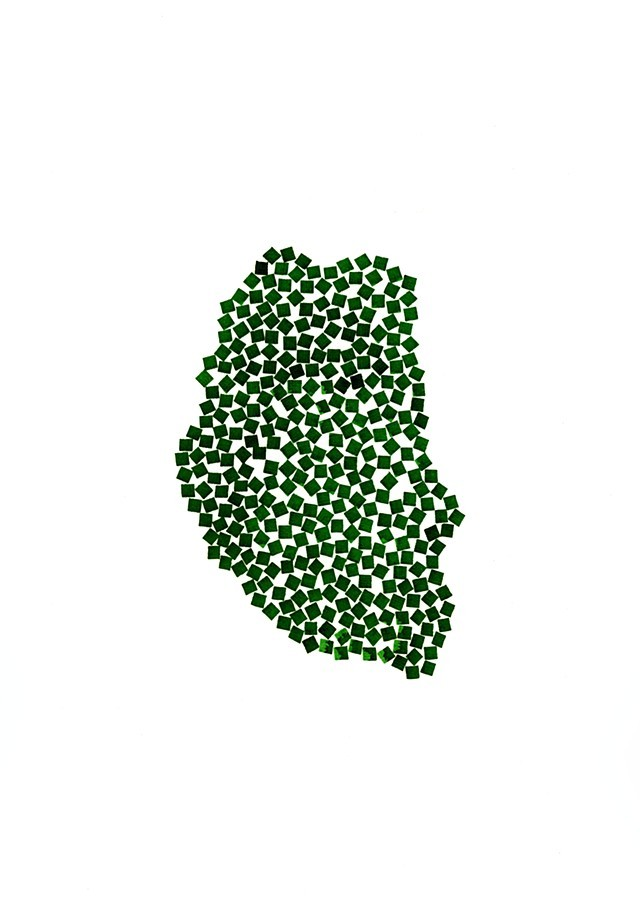

+++
date = "2017-05-08T13:49:56+01:00"
title = "Team"
tags = []
type = "post"
categories = []

+++

We are based at Northumbria University in the beautiful North East of England, and participate in the [Northumbria University Photovoltaics group](https://sites.google.com/view/nupv), [Energy Futures](https://www.northumbria.ac.uk/about-us/academic-departments/mathematics-physics-and-electrical-engineering/research/renewable-energy-technologies-and-materials/) and the [North East Centre for Energy Materials](https://research.ncl.ac.uk/necem/).

<big>
<b>Team Atoms</b> </big>

[Lucy Whalley](https://lucydot.github.io/about) - Associate Professor - *HackThePlanet*  

[Prakriti Kayastha](https://scholar.google.com/citations?user=XIU5zG4AAAAJ&hl=en) - PhD student - *(An)harmonic vibrations in chalcogenide perovskites* 

  

<big>
<b>Previous team members</b> </big>

[Dr Michael Jones](https://uk.linkedin.com/in/michael-jones-8a6b6a191) - PhD student - *Interface Engineering in CZTS thin film solar cells*  

[Ify Nwabuokei](https://github.com/ifylala) - Student intern - *Singing Materials: Sonification of first-principles phonon data*  

[William Taylor](https://github.com/musicmrman99) - Student intern (Northumbria University)  - *Oswald HPC documentation*  

Kishore Varadapureddi - Advanced Practice student (Northumbria University) - *Computational Screening of spinel compounds for battery applications*  

Kiran Veeramalla - Advanced Practice student (Northumbria University) - *Computational Screening of spinel compounds for battery applications*  

Tianhao Zhu - BEng project student (Northumbria University) - *Community Energy Projects: a feasibility study*  

Susannah Lea - BEng project student (Imperial College London) - *Effective mass of cuprous oxide* [co-supervisor]  

  

<big>
<b>Opportunities</b> </big>

We are always interested in hearing from potential new members and collaborators - [please get in touch](https://lucydot.github.io/about/). 

Any PhD/job opportunities will be listed here, and, for the right candidate, there is also the possibility to apply for external funding (e.g. the [Marie Curie IF](https://ec.europa.eu/research/mariecurieactions/actions/individual-fellowships_en)).

For smaller undergraduate, postgraduate and summer placement projects please see a project list that I maintain [here](https://lucydot.github.io/projects_list/).

